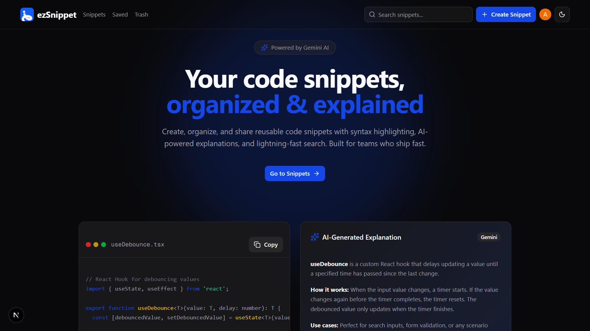
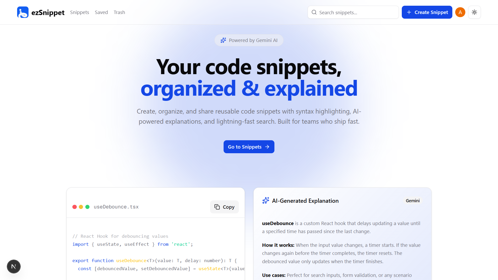
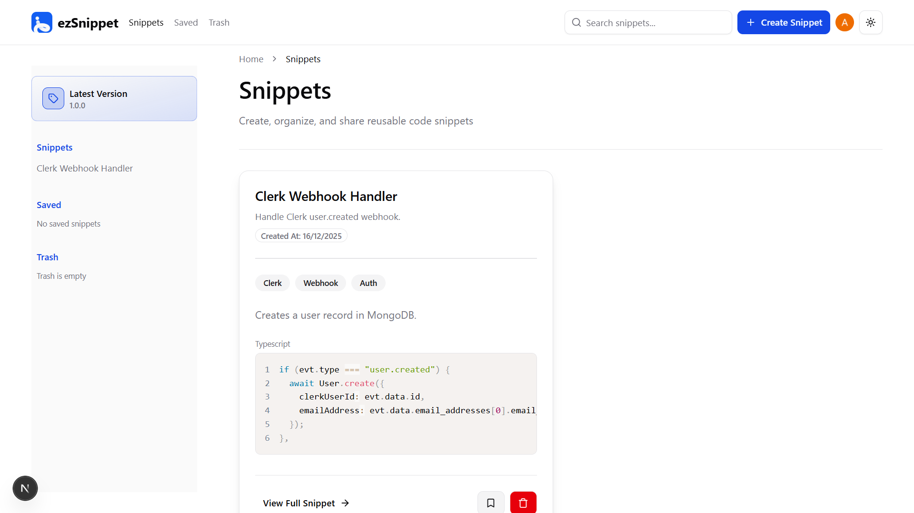
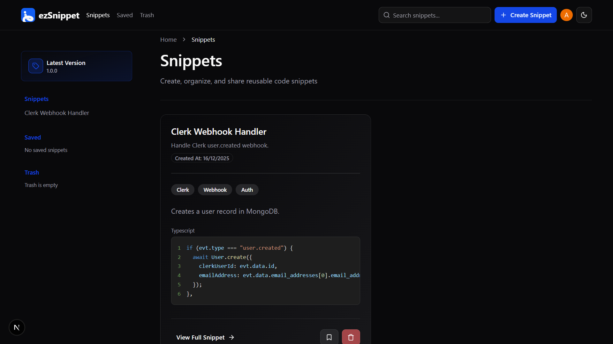
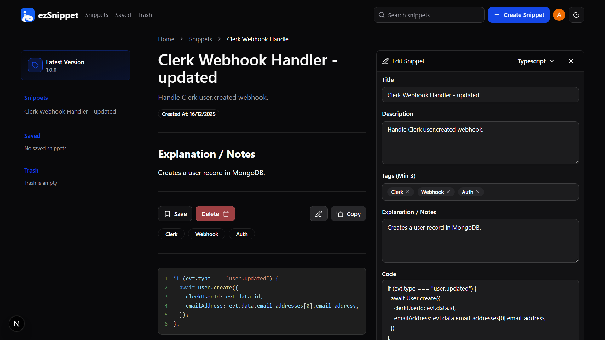
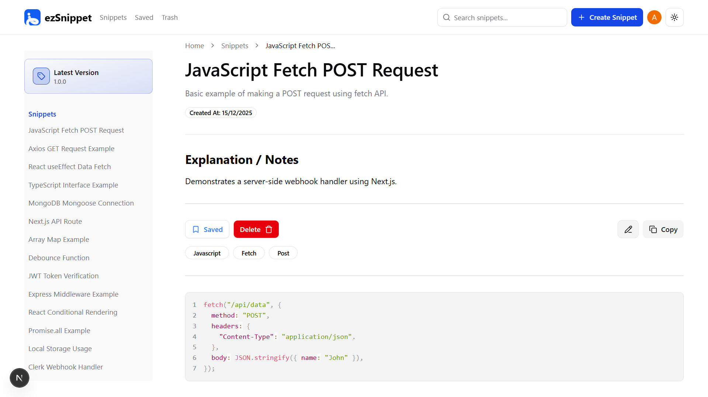
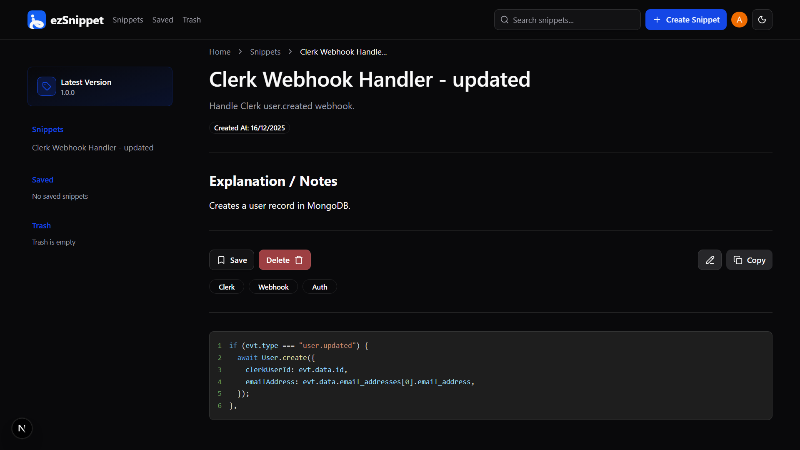

# EzSnippet

EzSnippet is a modern, feature-rich code snippet management tool designed to help developers organize, store, and access their reusable code blocks efficiently. Built with Next.js and MongoDB, it offers a seamless experience with a beautiful UI.



## Features

- **Create & Edit Snippets**: Easily create new snippets with syntax support for multiple languages.
- **Syntax Highlighting**: robust syntax highlighting for improved readability.
- **Organization**: Tagging system to categorize snippets (e.g., React, Hooks, Utils).
- **Search & Filter**: Quickly find snippets by title, language, or tags.
- **Dark/Light Mode**: Fully responsive design with native dark mode support.
- **Favorites & Trash**: Mark important snippets as favorites and safely restore deleted ones.
- **Authentication**: Secure user authentication via Clerk.

## Screenshots

### Home & Dashboard

|                        Light Mode                         |                        Dark Mode                        |
| :-------------------------------------------------------: | :-----------------------------------------------------: |
|          |          |
|  |  |

### Snippet Management

|                         Editor Light                          |                         Editor Dark                         |
| :-----------------------------------------------------------: | :---------------------------------------------------------: |
|  |  |

### Details View

|                         Details Light                         |                        Details Dark                         |
| :-----------------------------------------------------------: | :---------------------------------------------------------: |
|  |  |

## Tech Stack

- **Framework**: [Next.js 15](https://nextjs.org/)
- **Language**: [TypeScript](https://www.typescriptlang.org/)
- **Styling**: [Tailwind CSS](https://tailwindcss.com/)
- **Database**: [MongoDB](https://www.mongodb.com/) & [Mongoose](https://mongoosejs.com/)
- **Auth**: [Clerk](https://clerk.com/)
- **UI Components**: [Radix UI](https://www.radix-ui.com/) & [Lucide Icons](https://lucide.dev/)
- **Forms**: [React Hook Form](https://react-hook-form.com/) & [Zod](https://zod.dev/)

## Project Structure

```bash
ezsnippet/
├── app/                    # Next.js app router pages and layouts
│   ├── (auth)/            # Authentication routes (sign-in, sign-up)
│   ├── (shared-layout)/   # App routes with shared sidebar layout
│   ├── api/               # API routes for snippets
│   └── layout.tsx         # Root layout
├── components/             # Reusable UI components
│   ├── ui/                # Base UI components (buttons, inputs, etc.)
│   └── web/               # Feature-specific components (SnippetCard, Editor, etc.)
├── hooks/                  # Custom React hooks
├── lib/                    # Utility functions and DB connection
├── public/                 # Static assets (images, icons)
│   └── readme/            # Images used in README
└── types/                  # TypeScript type definitions
```

## Getting Started

### Prerequisites

- Node.js (v18+)
- MongoDB connection string
- Clerk API keys

### Installation

1. Clone the repository:

   ```bash
   git clone https://github.com/ArunKushhhh/ezSnippet.git
   cd ezsnippet
   ```

2. Install dependencies:

   ```bash
   npm install
   ```

3. Set up environment variables:
   Create a `.env.local` file in the root directory and add:

   ```env
   NEXT_PUBLIC_CLERK_PUBLISHABLE_KEY=your_clerk_pub_key
   CLERK_SECRET_KEY=your_clerk_secret_key
   MONGODB_URI=your_mongodb_uri
   ```

4. Run the development server:

   ```bash
   npm run dev
   ```

5. Open [http://localhost:3000](http://localhost:3000) with your browser to see the result.
